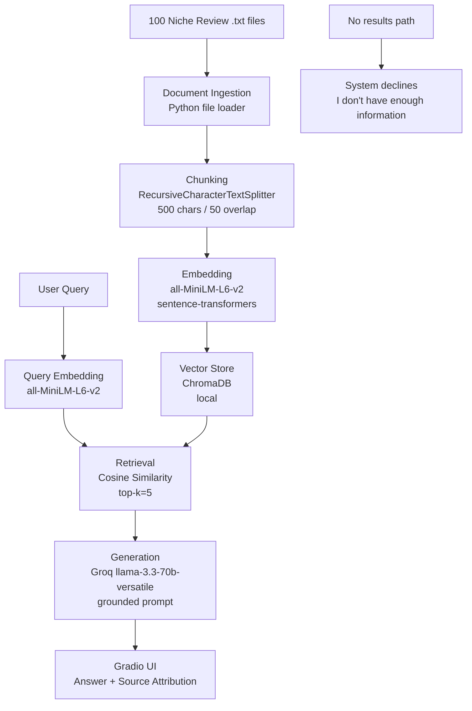

# Project 1 Planning: The Unofficial Guide

> Write this document before you write any pipeline code.
> Your spec and architecture diagram are what you'll use to direct AI tools (Claude, Copilot, etc.) to generate your implementation — the more specific they are, the more useful the generated code will be.
> Update the Retrieval Approach and Chunking Strategy sections if you change your approach during implementation.
> Update this file before starting any stretch features.

---

## Domain

Student reviews of Northwestern University sourced from Niche.com, covering academics, social life, dining, housing, campus culture, weather, and cost. Reviews span the past 4 years and represent unfiltered student opinions. This knowledge is valuable and hard to find through official channels because Northwestern's own materials are promotional. These honest assessments of what daily life is actually like only exist in student-generated content like these reviews.

---

## Documents

| #       | Source        | Description | URL or location                                                 |
| ------- | ------------- | ----------- | --------------------------------------------------------------- |
| 1 - 100 | Niche Reviews | .txt files  | https://www.niche.com/colleges/northwestern-university/reviews/ |

---

## Chunking Strategy

**Chunk size:** 500 characters

**Overlap:** 50 characters

**Reasoning:** Niche reviews vary in length from ~200 characters (short opinions) to ~1000 characters (detailed multi-topic reviews). Recursive character splitting is used over fixed-size chunking because it respects natural sentence and paragraph boundaries, splitting only when necessary and preferring cleaner breaks over random cuts mid-sentence. A 500-character cap keeps each chunk focused on one coherent thought while accommodating the average review length without splitting it at all. A 50-character overlap ensures that context is not lost at chunk boundaries for the minority of longer reviews that get split into two chunks. Semantic chunking was considered but rejected — it is computationally expensive and unnecessary for short opinion-based text where each review is already topically focused.

---

## Retrieval Approach

**Embedding model:** all-MiniLM-L6-v2 via sentence-transformers. It runs locally with no API key or rate limits.

**Top-k:** 5 chunks per query. This is enough to capture diverse student opinions on a topic without overwhelming the LLM with loosely related content.

**Production tradeoff reflection:** For a production deployment, the main tradeoffs to consider would be accuracy vs. cost vs. latency. all-MiniLM-L6-v2 is fast and free but was trained on general text. It would be more effective to use a domain-specific model fine-tuned on student review data would likely produce better semantic matches. OpenAI's text-embedding-3-large would offer higher accuracy at the cost of per-call API fees and latency. If the system needed to serve international students, a multilingual model like paraphrase-multilingual-MiniLM-L12-v2 would be worth considering despite its larger size. At scale, local models are lower accuracy but cheaper.

---

## Evaluation Plan

| #   | Question                                                                    | Expected answer                                                                                  |
| --- | --------------------------------------------------------------------------- | ------------------------------------------------------------------------------------------------ |
| 1   | What do people say about weather during winter?                             | It gets really cold and depressing.                                                              |
| 2   | What do students say about the quarter system?                              | It's fast paced but opportunity for more classes.                                                |
| 3   | What is the difference in social scene between North and South campus?      | North campus is louder and has more parties and South campus is quieter.                         |
| 4   | What do students say about the cost of attending Northwestern?              | It is very expensive. Some felt it was worth it and other's didn't.                              |
| 5   | What do students say about professor accessibility and willingness to help? | Professors are generally caring and willing to help students academically and with career goals. |

---

## Anticipated Challenges

<!-- What could go wrong? Name at least two specific risks with reasoning.
     Consider: noisy or inconsistent documents, missing source attribution, off-topic
     retrieval, chunks that split key information across boundaries. -->

1. Niche reviews frequently cover multiple topics within a single review. A student might mention tuition, dining, and social life all in one paragraph. If recursive splitting doesn't break these apart cleanly, the embedding averages across all topics and weakens the semantic signal. A query about dining halls could retrieve a chunk that mentions food briefly but is mostly about cost. This silently fails and the system returns a sourced answer that looks legitimate but is based on the wrong content.

2. Northwestern reviews are divided on topics like the quarter system, social scene, and cost. Without explicit prompt design instructing the LLM to represent the full range of views, it will default to the majority or most confident opinion and present it as fact. A prospective student asking "is the social scene good?" could receive a confidently positive answer that ignores the significant number of students who found it lacking. This is a prompting challenge as much as a retrieval one.

---

## Architecture

---

## AI Tool Plan

**Milestone 3 — Ingestion and chunking:**
I will use Claude Code with the Architecture diagram and Chunking Strategy section as input. I will ask it to implement a script that loads all .txt files from the documents/ folder, cleans whitespace, and splits them using RecursiveCharacterTextSplitter with 500 character chunk size and 50 character overlap. I will verify the output by printing 5 sample chunks and confirming they are clean, complete sentences under 500 characters.

**Milestone 4 — Embedding and retrieval:**
I will use Claude Code with the Retrieval Approach section and Architecture diagram as input. I will ask it to implement embedding with all-MiniLM-L6-v2 via sentence-transformers, store vectors in ChromaDB with source metadata, and write a retrieval function that returns top-5 chunks with source filenames. I will verify by running 3 evaluation plan queries and checking that returned chunks are relevant.

**Milestone 5 — Generation and interface:**
I will use Claude Code with the full planning.md and Anticipated Challenges section as input. I will ask it to implement the Groq llama-3.3-70b-versatile generation step with a grounding prompt that explicitly handles mixed opinions and includes source attribution. I will verify by testing all 5 evaluation questions.
